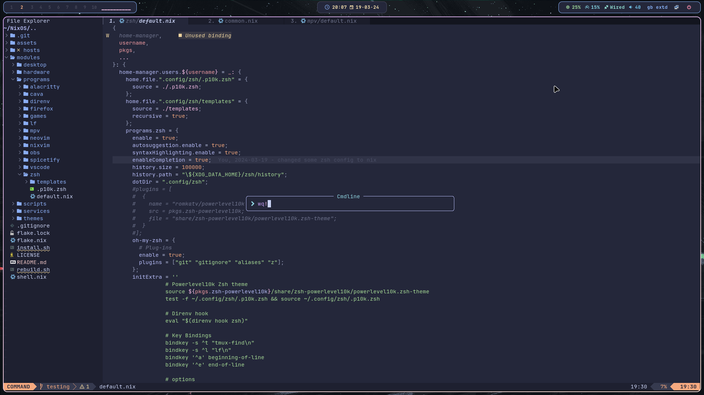

# Nixvim



## Run
```Nix
nix run github:thapasijan17/nixvim
```

## Install on NixOS
### Add this to your flake.nix
```Nix
nixvim.url = "github:thapasijan17/nixvim";
```
### Then in your home-manager configuration add this
```Nix
{ inputs, pkgs, ... }:

{
    home.packages = with pkgs; [
        inputs.nixvim.packages.${system}.default
    ];
}
```
